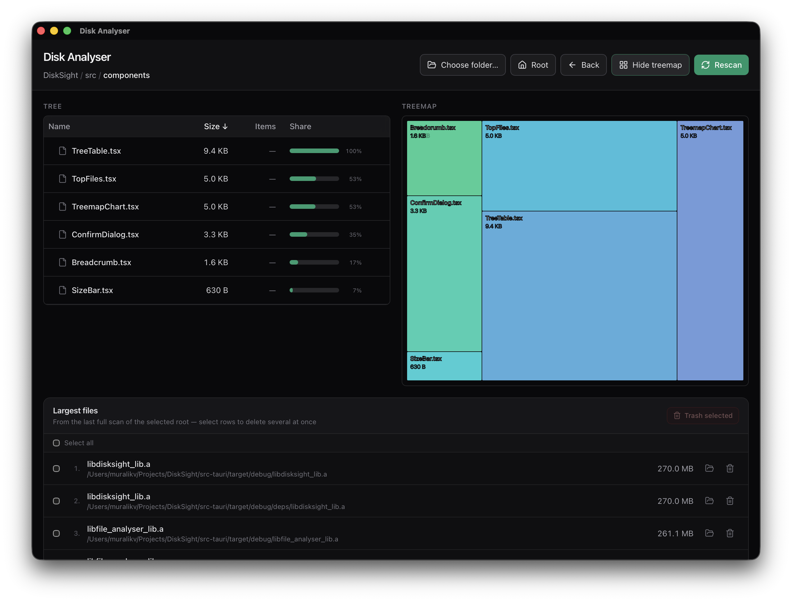

# DiskSight

Desktop disk usage analyzer: **[Tauri 2](https://tauri.app/)** desktop shell, **Rust** filesystem scanner, **React** UI (Vite, Tailwind, Recharts).



## Features

- **Folder scope** — Pick a directory via the system dialog (prompted on launch). Breadcrumb navigation plus **Root** and **Back** to move within the scanned tree.
- **Tree** — Per-folder listing with aggregate sizes, item counts, and horizontal **share** bars (relative to the current folder). Sort by name or size; expand folders inline. Large or dependency-style folders (for example `node_modules`, `.git`, build outputs) load **lazily** when opened, so the first scan stays faster.
- **Treemap** — Optional panel comparing child folders/files at the **current** location (toggle **Show treemap**).
- **Largest files** — Top files from the **last full scan** (20 by default). Select one or many, confirm, then **move to trash** (uses the system trash where available). **Reveal in Finder** is supported on **macOS** only.
- **Scan lifecycle** — Live progress (files counted, bytes tallied, elapsed time, current path), **Cancel scan**, and **Rescan** the current root.

## Prerequisites

- [Node.js](https://nodejs.org/) (npm)
- [Rust](https://rustup.rs/) — **1.77+** (`rust-version` in `src-tauri/Cargo.toml`)
- [Tauri v2 prerequisites](https://v2.tauri.app/start/prerequisites/) for your OS (e.g. Xcode Command Line Tools on macOS)

## Setup

```bash
git clone <repository-url>
cd DiskSight
npm install
```

## Run

**Full desktop app** (recommended) — starts Vite at **http://localhost:1420** and opens the native window:

```bash
npm run tauri dev
```

**Vite only** — useful for frontend tweaks; **scanning, trash, and reveal require the Tauri app** (`tauri dev` or a built binary).

```bash
npm run dev
```

**Production asset preview in the browser** (same limitation as Vite-only for backend commands):

```bash
npm run build
npm run preview
```

## Build

```bash
npm run tauri build
```

Installers and bundles are written under `src-tauri/target/release/bundle/` (exact artifacts depend on OS and `src-tauri/tauri.conf.json`).
