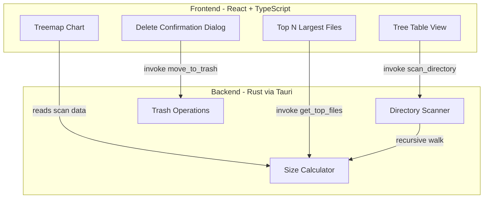

# Disk Analyser — Tauri + React macOS App

## Architecture




## Tech Stack

- **Backend**: Rust (Tauri v2) with `walkdir` crate for fast directory traversal and `trash` crate for macOS Trash support
- **Frontend**: React 18 + TypeScript + Vite
- **Styling**: Tailwind CSS for a clean, modern UI
- **Treemap Chart**: `recharts` (has a built-in Treemap component, lightweight)
- **Icons**: `lucide-react` for file/folder icons

## Key Features

1. **Tree Table View** — Expandable folder tree with columns: Name, Size (human-readable), Items count, Size bar (visual percentage). Sorted largest-first by default.
2. **Treemap Visualization** — Interactive treemap where rectangle area = file/folder size. Click to drill into folders.
3. **Top N Largest Files** — Side panel showing the 20 largest files across the entire scan with quick "Reveal in Finder" and "Move to Trash" actions.
4. **Move to Trash** — All delete operations go to macOS Trash (recoverable). A confirmation dialog shows the item name and size before trashing.
5. **Home Directory Start** — Scans `~/` on launch. Breadcrumb navigation to go deeper or back up.

## Backend Design (Rust)

### Tauri Commands

- `scan_directory(path: String)` — Recursively scans and returns a tree structure with sizes. Uses `walkdir` for fast traversal, skips permission-denied directories gracefully.
- `get_top_files(path: String, count: usize)` — Returns the N largest files found during scan.
- `move_to_trash(path: String)` — Moves file/folder to macOS Trash using the `trash` crate.
- `open_in_finder(path: String)` — Opens the file location in Finder via `Command::new("open")`.

### Data Model

```rust
struct FileEntry {
    name: String,
    path: String,
    size: u64,           // bytes
    is_dir: bool,
    children: Option<Vec<FileEntry>>,
    item_count: u32,     // number of items inside (for dirs)
}
```

Scanning will be async and emit progress events to the frontend via Tauri events so the UI stays responsive during large scans.

## Frontend Design

### Layout

```
+------------------------------------------+
|  Breadcrumb: ~ / Documents / Projects    |
|  [Rescan] [Back]                         |
+------------------+-----------------------+
|                  |                       |
|  Tree Table      |  Treemap Chart        |
|  (left panel)    |  (right panel)        |
|                  |                       |
|  Name | Size |   |  [interactive         |
|  folder1  5GB    |   rectangles]         |
|   ├─ sub1  3GB   |                       |
|   └─ sub2  2GB   |                       |
|  folder2  2GB    |                       |
|                  |                       |
+------------------+-----------------------+
|  Top 20 Largest Files                    |
|  1. video.mp4  4.2 GB  [Trash] [Reveal]  |
|  2. backup.zip 1.8 GB  [Trash] [Reveal]  |
+------------------------------------------+
```

### Key UI Behaviors

- Clicking a folder in the tree table or treemap drills into it
- Size bars in the table show relative size vs the parent folder
- Human-readable sizes: bytes, KB, MB, GB, TB
- Sorting: click column headers to sort by name or size
- Loading spinner + progress during scans
- Confirmation modal before any trash operation: "Move `filename` (2.3 GB) to Trash?"

## Project Structure

```
disksight/
├── src-tauri/
│   ├── Cargo.toml          # Rust deps: tauri, walkdir, trash, serde
│   ├── src/
│   │   ├── main.rs         # Tauri app entry
│   │   ├── commands.rs     # scan_directory, move_to_trash, etc.
│   │   └── scanner.rs      # Directory walking & size calculation
│   └── tauri.conf.json     # Tauri config, permissions
├── src/
│   ├── App.tsx             # Main layout with panels
│   ├── components/
│   │   ├── TreeTable.tsx   # Expandable tree table
│   │   ├── TreemapChart.tsx# Recharts treemap
│   │   ├── TopFiles.tsx    # Top N largest files panel
│   │   ├── Breadcrumb.tsx  # Path navigation
│   │   ├── SizeBar.tsx     # Visual size indicator
│   │   └── ConfirmDialog.tsx # Trash confirmation modal
│   ├── hooks/
│   │   └── useScanner.ts   # Tauri invoke wrappers + state
│   ├── utils/
│   │   └── format.ts       # formatBytes, etc.
│   └── main.tsx            # React entry
├── package.json
├── tailwind.config.js
├── tsconfig.json
├── vite.config.ts
└── README.md
```

## Prerequisites

- **Rust** toolchain (rustup) — needed for Tauri backend
- **Node.js** 18+ — for React frontend
- Tauri CLI: installed via `cargo install tauri-cli` or `npm`

## Implementation Notes

- The scanner skips `/System`, `/Library`, and other macOS protected directories that would trigger permission errors
- Large directories (e.g., `node_modules`) are summarized without deep child expansion until the user clicks into them (lazy loading)
- The `trash` crate uses macOS native `NSFileManager` API, so trashed items appear in Finder's Trash with proper "Put Back" support
- File sizes use `std::fs::metadata` which is fast and doesn't read file contents

